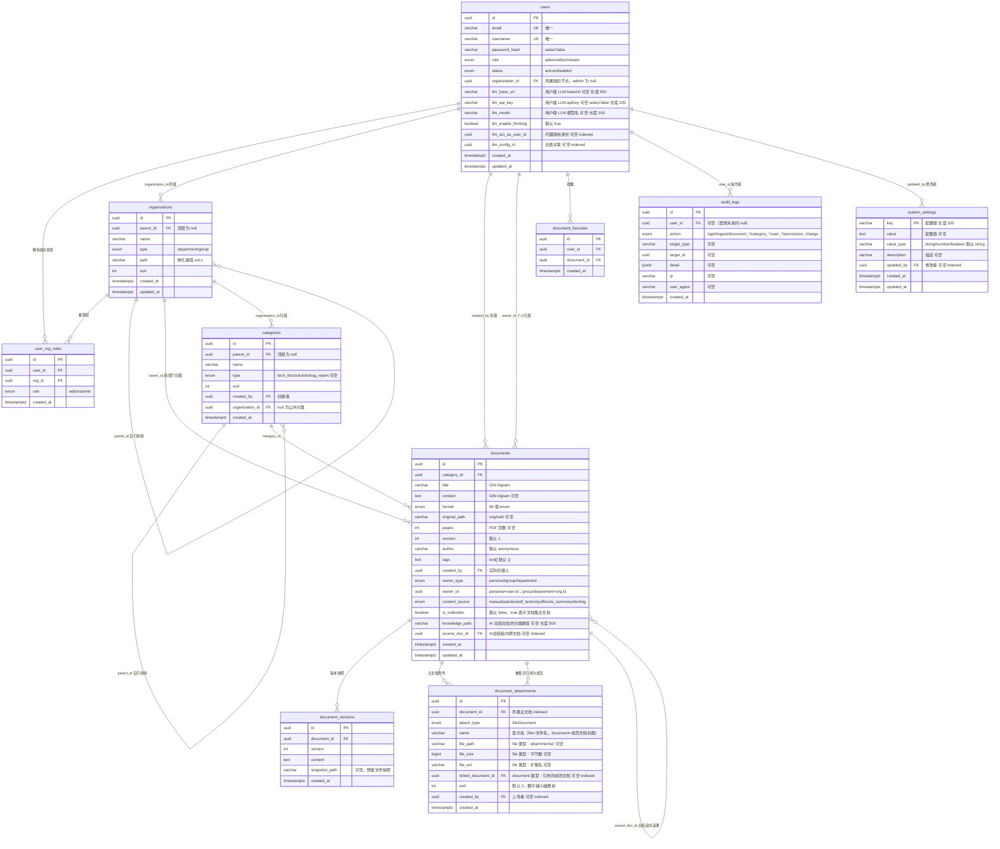

# 数据库设计

本文描述 LXDOC 的数据库表结构、关系与索引。数据库为 PostgreSQL 16，启用 `pg_trgm` 扩展用于中文模糊检索。

## ER 图



## 表结构详解

### users

用户表。

| 字段 | 类型 | 约束 | 说明 |
|---|---|---|---|
| id | uuid PK | default gen_random_uuid() | |
| email | varchar(200) | UNIQUE NOT NULL | 登录邮箱 |
| username | varchar(100) | UNIQUE NOT NULL | 显示名 |
| password_hash | varchar(200) | NOT NULL, select:false | bcryptjs 哈希，默认查询不返回 |
| role | enum | NOT NULL default 'viewer' | admin / editor / viewer |
| status | enum | NOT NULL default 'active' | active / disabled |
| organization_id | uuid | nullable, indexed | 所属组织节点，全局 admin 为 null |
| llm_base_url | varchar(500) | nullable | 用户级 LLM 服务地址，覆盖系统配置 |
| llm_api_key | varchar(200) | nullable, select:false | 用户级 LLM apiKey，默认查询不返回 |
| llm_model | varchar(100) | nullable | 用户级 LLM 模型名 |
| llm_enable_thinking | boolean | default true | 是否启用思考模式（GLM-5.2 等推理模型可关闭以加速简单任务） |
| llm_act_as_user_id | uuid | nullable, indexed | 代理调用时以该用户身份计费/限流（仅 admin 可设置） |
| llm_config_id | uuid | nullable, indexed | 关联旧 `llm_configs` 表（向后兼容） |
| created_at | timestamptz | | |
| updated_at | timestamptz | | |

### organizations

组织树节点（通用树）。

| 字段 | 类型 | 约束 | 说明 |
|---|---|---|---|
| id | uuid PK | | |
| parent_id | uuid | nullable, indexed | 父节点；顶层部门为 null |
| name | varchar(100) | NOT NULL | |
| type | enum | NOT NULL | department / group |
| path | varchar(2048) | NOT NULL, indexed | 物化路径，段以 `.` 分隔，每段为 UUID |
| sort | int | default 0 | |
| created_at | timestamptz | | |
| updated_at | timestamptz | | |

**path 规则**：顶层部门 `path = <自身 id>`；子组 `path = <父 path>.<自身 id>`。读权限用前缀匹配判断祖先关系。

### user_org_roles

用户在某组织节点的编辑授权。

| 字段 | 类型 | 约束 | 说明 |
|---|---|---|---|
| id | uuid PK | | |
| user_id | uuid | NOT NULL, indexed | |
| org_id | uuid | NOT NULL, indexed | |
| role | enum | NOT NULL | editor / admin（在该节点的角色） |
| created_at | timestamptz | | |

**约束**：`UNIQUE(user_id, org_id)`（命名 `uq_user_org`），避免重复授权。

**语义**：
- `editor`：可编辑该节点及其子树下的文档
- `admin`：可编辑 + 可管理该节点成员与子节点（向下继承）

全局 `users.role = admin` 不受此表约束（全权）。

### categories

分类树。

| 字段 | 类型 | 约束 | 说明 |
|---|---|---|---|
| id | uuid PK | | |
| parent_id | uuid | nullable, indexed | 父分类；顶层为 null |
| name | varchar(100) | NOT NULL | |
| type | enum | nullable | tech_doc / solution / bug_report；顶层必填，子分类继承 |
| sort | int | default 0 | |
| created_by | uuid | nullable, indexed | 创建者 |
| organization_id | uuid | nullable, indexed | 所属组织；null 为公共分类 |
| created_at | timestamptz | | |

### documents

文档主表。

| 字段 | 类型 | 约束 | 说明 |
|---|---|---|---|
| id | uuid PK | | |
| category_id | uuid | NOT NULL, indexed | 所属分类 |
| title | varchar(200) | NOT NULL, indexed | GIN trigram |
| content | text | nullable, indexed | GIN trigram；md/txt/csv/tsv 为原文；docx 为 pandoc 抽取的索引文本；pdf 为 docling/pdf-parse 全文 |
| format | enum | NOT NULL | 36 值：md/txt/csv/tsv/doc/docx/dot/dotm/dotx/odt/ott/rtf/wps/wpt/ofd/xls/xlsx/xlsm/xlt/xltm/xlam/ods/ots/fods/et/ett/ppt/pptx/pptm/odp/otp/dps/pdf |
| original_path | varchar | nullable | 原文件相对路径 `original/<docId>/<file>` |
| pages | int | nullable | PDF 页数 |
| version | int | default 1 | 版本号，每次更新/回滚/OnlyOffice 保存 +1 |
| author | varchar | default 'anonymous' | |
| tags | text[] | default '{}' | |
| created_by | uuid | nullable, indexed | 实际创建人（不变） |
| owner_type | enum | default 'personal' | personal / group / department |
| owner_id | uuid | nullable | personal→user.id；group/department→org.id |
| content_source | enum | default 'manual' | manual / pandoc / pdf_text / onlyoffice / ai_summary / docling |
| is_collection | boolean | default false | true 表示文档集主文档（无原文件，附件聚合成员） |
| knowledge_path | varchar(500) | nullable, indexed | AI 总结文档的分类路径（slash 分隔，如 `技术文档/操作系统/Linux`，前端据此构建知识树） |
| source_doc_id | uuid | nullable, indexed | AI 总结文档指向原文档的 id；普通文档为 null |
| created_at | timestamptz | | |
| updated_at | timestamptz | | |

**owner 语义**：
- `personal` + `owner_id = 创建者 id`：个人私有空间
- `group` / `department` + `owner_id = organization.id`：归属组织节点

**is_collection 语义**：
- true 时该文档为「文档集主文档」，不存原文件，仅作聚合容器
- 通过 `document_attachments`（attachType='document'）引用集合成员
- 列出附件时，集合成员自动 union 集合主文档的 file 类型附件（共享附件）

### document_attachments

文档附件表（主文档挂附件 / 集合引用成员）。

| 字段 | 类型 | 约束 | 说明 |
|---|---|---|---|
| id | uuid PK | default gen_random_uuid() | |
| document_id | uuid | NOT NULL, indexed | 所属主文档 |
| attach_type | varchar(20) | NOT NULL | file（落盘附件文件） / document（引用集合成员） |
| name | varchar(200) | NOT NULL | 显示名（file 类型为文件名，document 类型为成员文档标题） |
| file_path | varchar(500) | nullable | file 类型：`attachments/<docId>/<file>` 相对路径 |
| file_size | bigint | nullable | file 类型：文件字节数 |
| file_ext | varchar(20) | nullable | file 类型：扩展名（如 .zip .py） |
| linked_document_id | uuid | nullable, indexed | document 类型：被引用为集合成员的文档 id |
| sort | int | default 0 | 排序值，数字越小越靠前 |
| created_by | uuid | nullable, indexed | 上传者 |
| created_at | timestamptz | | |

**索引**：`(document_id, sort)` 复合索引（用于按主文档列出并排序）；`linked_document_id` 单列索引（反查集合成员关系）。

**约束**：无数据库层 UNIQUE 约束；「同一文档不能重复加入同一集合」由 `AttachmentsService.linkDocument` 在应用层校验（`if (exists) throw BadRequestException('该文档已是集合成员')`）。

### document_favorites

文档收藏关系表（user × document 多对多）。

| 字段 | 类型 | 约束 | 说明 |
|---|---|---|---|
| id | uuid PK | | |
| user_id | uuid | NOT NULL, indexed | 收藏者 |
| document_id | uuid | NOT NULL, indexed | 被收藏文档 |
| created_at | timestamptz | | |

**约束**：`UNIQUE(user_id, document_id)`，同一用户对同一文档只能收藏一次。

### system_settings

系统配置覆盖表（admin 在线修改的运行时配置）。

| 字段 | 类型 | 约束 | 说明 |
|---|---|---|---|
| key | varchar(100) PK | | 配置键（14 项可改配置，如 `llm.enabled` / `auth.allowSignup`） |
| value | text | nullable | 配置值（按 value_type 解释） |
| value_type | varchar(20) | default 'string' | string / number / boolean |
| description | varchar(200) | nullable | 描述 |
| updated_by | uuid | nullable, indexed | 修改者 user_id |
| created_at | timestamptz | | |
| updated_at | timestamptz | | |

后端启动时读全表构建内存覆盖层（`settings-overrides.ts` Map），config getter 优先读覆盖层，无需重启立即生效。详见 [deployment.md#可在线修改的配置项](./deployment.md#可在线修改的配置项)。

### document_versions

版本快照。

| 字段 | 类型 | 约束 | 说明 |
|---|---|---|---|
| id | uuid PK | | |
| document_id | uuid | NOT NULL | |
| version | int | NOT NULL | |
| content | text | | 该版本内容 |
| snapshot_path | varchar | nullable | 预留文件快照路径 |
| created_at | timestamptz | | |

**写入时机**：每次更新 / 回滚 / OnlyOffice 回调时，先把**当前**内容写入（version=当前），再 `documents.version + 1`。回滚把目标版本内容作为新版本写入，不破坏历史。

### audit_logs

审计日志。

| 字段 | 类型 | 约束 | 说明 |
|---|---|---|---|
| id | uuid PK | | |
| user_id | uuid | nullable, indexed | 操作者；登录失败时为 null |
| action | enum | NOT NULL, indexed | login / logout / document_create / document_update / document_delete / category_create / category_delete / user_create / user_update / user_delete / permission_change |
| target_type | varchar(50) | nullable | 资源类型 |
| target_id | uuid | nullable | 资源 id |
| detail | jsonb | nullable | 详情 |
| ip | varchar(50) | nullable | |
| user_agent | varchar(500) | nullable | |
| created_at | timestamptz | indexed | |

由 `AuditInterceptor` 在 handler 成功返回后按 `@Audit()` 装饰器自动写入。

## 索引

### TypeORM 实体声明的索引（`synchronize` 自动创建）

| 表 | 字段 | 类型 | 用途 |
|---|---|---|---|
| users | email | UNIQUE | 登录 |
| users | username | UNIQUE | |
| users | organization_id | INDEX | 按组织查用户 |
| organizations | parent_id | INDEX | 树查询 |
| organizations | path | INDEX | 前缀匹配读权限 |
| user_org_roles | (user_id) | INDEX | 查用户授权 |
| user_org_roles | (org_id) | INDEX | 查节点成员 |
| user_org_roles | (user_id, org_id) | UNIQUE | 防重复授权 |
| categories | parent_id | INDEX | 树查询 |
| categories | created_by | INDEX | editor 权限判断 |
| categories | organization_id | INDEX | 按组织过滤 |
| documents | category_id | INDEX | 分类下列表 |
| documents | title | INDEX | 精确查询 |
| documents | content | INDEX | 精确查询 |
| documents | created_by | INDEX | 我的文档 |
| documents | owner_type | INDEX | 权限过滤 |
| documents | source_doc_id | INDEX | AI 总结反向追溯 |
| documents | knowledge_path | INDEX | 知识树路径查询 |
| document_attachments | document_id | INDEX | 列主文档附件 |
| document_attachments | (document_id, sort) | INDEX | 按主文档列出并排序 |
| document_attachments | linked_document_id | INDEX | 反查集合成员关系 |
| document_attachments | created_by | INDEX | 按上传者筛选 |
| document_favorites | user_id | INDEX | 用户收藏列表 |
| document_favorites | document_id | INDEX | 文档收藏者 |
| document_favorites | (user_id, document_id) | UNIQUE | 防重复收藏 |
| system_settings | key | PK | 配置键 |
| users | llm_config_id | INDEX | 旧 LLM 配置关联 |
| audit_logs | user_id | INDEX | 按用户筛选 |
| audit_logs | action | INDEX | 按动作筛选 |
| audit_logs | created_at | INDEX | 按时间筛选 |

### 手动创建的索引（`AppModule.onApplicationBootstrap`）

通过原始 SQL `CREATE INDEX IF NOT EXISTS` 创建：

```sql
-- pg_trgm 扩展
CREATE EXTENSION IF NOT EXISTS pg_trgm;

-- 中文模糊检索 GIN trigram 索引
CREATE INDEX IF NOT EXISTS idx_documents_title_trgm  ON documents USING gin (title gin_trgm_ops);
CREATE INDEX IF NOT EXISTS idx_documents_content_trgm ON documents USING gin (content gin_trgm_ops);
```

`pg_trgm` 把字符串拆成 3-gram，支持 `%keyword%` 模糊匹配与相似度排序，中文友好。

## 扩展

| 扩展 | 用途 |
|---|---|
| `pg_trgm` | 全文检索（trigram + GIN） |
| `gen_random_uuid()` | uuid 默认值（pgcrypto 内置，PG13+ 无需显式启用） |

## 数据迁移

`AppModule.onApplicationBootstrap` 中执行的存量数据回填（幂等）：

```sql
-- 存量 Document 补 owner
UPDATE documents
SET owner_type = 'personal', owner_id = created_by
WHERE owner_type IS NULL OR owner_id IS NULL;

-- 存量 Document 补 content_source
UPDATE documents SET content_source = 'pdf_text' WHERE format = 'pdf' AND content_source = 'manual';
UPDATE documents SET content_source = 'pandoc' WHERE format IN ('docx','odt') AND content_source = 'manual';

-- 存量 Document 补 is_collection（默认 false）
UPDATE documents SET is_collection = false WHERE is_collection IS NULL;

-- 图片链接迁移到鉴权接口格式
UPDATE documents
SET content = REPLACE(content, '/uploads/images/', '/api/files/');
```

## 生产环境建议

- **关闭 synchronize**：`DB_SYNC=false`，用 TypeORM migration 管理 schema 变更
- **备份**：`backup` 容器 cron 执行 `pg_dump` + tar 打包 `uploads/`，详见 [deployment.md#备份与恢复](./deployment.md#备份与恢复)
- **大文本**：`documents.content` 与 `document_versions.content` 为 text，大文档注意表膨胀，可考虑分区或归档历史版本
- **连接池**：生产配置 `DB_POOL_MAX` 等参数
- **附件清理**：删除文档时 best-effort 清理 `original/`、`images/`、`attachments/`、`cache/` 下的对应文件；删除 file 类型附件时同步清理磁盘文件
